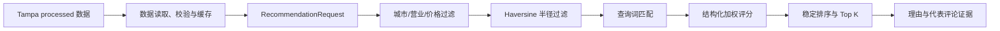
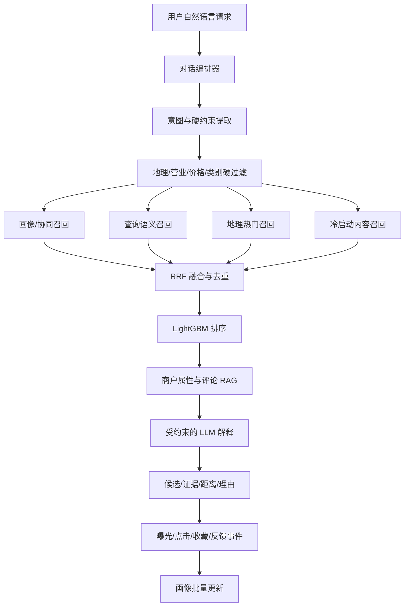
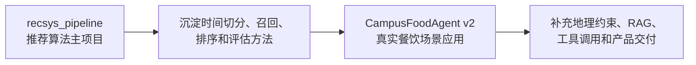

# CampusFoodAgent v2：基于 Yelp 数据的个性化餐饮推荐 Agent

> 最后更新：2026年7月15日
>
> 重构方案依据日期：2026年6月18日
>
> 当前版本：`v0.2.0`（Tampa processed 数据推荐 API 基线）

CampusFoodAgent v2 是一个基于 Yelp 真实商户、评论和历史交互数据重构的城市餐饮推荐项目。项目目标是把地理硬约束、个性化推荐、证据检索和受控 Agent 编排组合成可运行、可解释、可追溯的餐饮决策系统。

项目名称保留 `CampusFoodAgent`，但 v2 不再把能力限定为“校园餐饮”，也不声称拥有真实线上用户或线上实验结果。

## 目录

- [项目定位](#项目定位)
- [当前完成度](#当前完成度)
- [快速开始](#快速开始)
- [API 使用](#api-使用)
- [当前推荐链路](#当前推荐链路)
- [Yelp 数据策略](#yelp-数据策略)
- [目标系统架构](#目标系统架构)
- [推荐、RAG 与 Agent 的职责边界](#推荐rag-与-agent-的职责边界)
- [评估与测试计划](#评估与测试计划)
- [开发路线图](#开发路线图)
- [双项目关系](#双项目关系)
- [可信度与面试表述](#可信度与面试表述)
- [阶段文档](#阶段文档)
- [方案来源](#方案来源)

## 项目定位

建议对外描述：

> 基于 Yelp 真实商户与交互数据的个性化餐饮推荐 Agent。

项目主要证明以下能力：

| 能力 | v2 中的落点 | 预期证据 |
| --- | --- | --- |
| 推荐工程 | 地理、协同、语义、冷启动召回与融合排序 | 固定切分、离线指标、消融和分群结果 |
| 数据工程 | Yelp 商户、评论、交互、画像快照与数据清单 | schema、manifest、过滤统计和泄漏测试 |
| RAG | 商户属性、评论主题与代表评论证据 | document ID、review ID、检索评测与引用检查 |
| Agent 工程 | 结构化意图、受控工具、状态更新与故障降级 | 工具 trace、约束断言、场景回归和故障注入 |
| 在线服务 | FastAPI、Pydantic、版本化响应和自动化测试 | API 测试、延迟报告、错误与降级记录 |

一个典型的目标请求是：

```text
帮我找当前位置 3 公里内、现在营业、人均不要太贵、适合安静聊天的餐厅。
```

目标系统会把请求拆成：

- 硬约束：距离、营业状态、价格、菜系或饮食禁忌；
- 软偏好：安静、适合聊天、口味和场景；
- 个性化信号：历史类别、价格、地理范围和近期行为；
- 证据需求：商户属性及评论中关于环境、服务和口味的依据。

## 当前完成度

### 已实现

- FastAPI v2 后端和 Pydantic 请求/响应模型；
- 健康检查、数据集状态和餐厅推荐三个 API；
- 包含 5 家 Yelp 结构风格商户的小型 fixture，可在不加载原始数据时运行；
- 城市、半径、价格上限和营业状态硬过滤；
- 基于查询词、评分、评论数置信度、距离和价格的确定性评分；
- 返回推荐理由及最多两条代表评论证据；
- Yelp 原始 Business/Review 的单城市整理脚本；
- `businesses.jsonl`、`interactions.jsonl`、`representative_reviews.jsonl`、城市统计与 manifest 输出；
- processed 数据读取、字段校验和进程内缓存；
- Tampa processed 商户已接入默认推荐 API，结果 ID 和评论证据可追溯；
- 22 个 API、推荐、数据读取、数据整理和集成自动化测试。

### 当前在线 processed 数据

本地处理结果已经生成 Tampa 子集：

| 数据项 | 当前 manifest 记录值 |
| --- | ---: |
| 餐饮/食品商户 | 3,805 |
| 营业商户 | 2,596 |
| 关闭商户 | 1,209 |
| Review 映射交互 | 100,000 |
| 代表评论证据 | 29,092 |

这些数字来自 `backend/data/processed/data_manifest.json`，生成配置为 Tampa, FL、每个商户最多 40 条交互、每个商户最多 8 条代表评论。`/api/v2/dataset/status` 从 manifest 读取状态，`/api/v2/recommend` 默认读取 processed Business 和 RepresentativeReview。5 家 Philadelphia fixture 仅保留用于小数据回归和故障定位，不参与默认在线请求。

### 规划中

- 带 `as_of_time` 的用户画像快照与时间切分；
- 地理热门、ItemCF、查询语义和冷启动内容召回；
- RRF 融合及 LightGBM/LambdaMART 排序；
- 商户资料、评论主题摘要和代表评论的混合 RAG；
- 意图解析、证据检索、收藏、反馈和历史查询等受控工具；
- impression、click、favorite、dislike、rating 事件协议；
- 候选白名单、LLM/索引故障降级和端到端评估；
- 前端结果展示与完整三分钟演示链路。

> 状态说明：本 README 把“当前代码可证明的能力”和“重构目标”分开记录。规划项不能写入简历的已完成成果。

## 项目结构

```text
v2/
├── README.md
├── docs/                          # 数据说明、阶段计划和实施记录
└── backend/
    ├── app/
    │   ├── main.py                  # FastAPI v2 路由
    │   ├── models.py                # Pydantic API 模型
    │   ├── data_repository.py       # processed 数据读取、校验和缓存
    │   ├── recommender.py           # 硬过滤、规则评分和证据返回
    │   └── data_pipeline/
    │       └── curate_yelp.py       # Yelp 单城市数据整理
    ├── data/
    │   ├── README.md                # 数据取舍、字段和运行说明
    │   ├── archive/                 # 原始 Yelp 文件，仅本地保存
    │   ├── fixtures/                # 小型可测试数据
    │   └── processed/               # 本地整理结果与 manifest
    ├── tests/                       # API、推荐和数据整理测试
    ├── pytest.ini
    └── requirements.txt
```

当前技术栈：

| 类型 | 技术 |
| --- | --- |
| API | FastAPI `0.116.1`、Uvicorn `0.35.0` |
| 数据模型 | Pydantic `2.11.7` |
| 测试 | pytest `9.0.2`、HTTPX `0.28.1` |
| 数据处理 | Python 标准库流式读取与 JSONL 输出 |
| 当前推荐 | Haversine 距离、硬过滤、加权规则评分 |

## 快速开始

以下命令以仓库根目录 `CampusFoodAgent` 为起点，已在 Conda 环境 `D:\anaconda3\envs\chedian-eat-agent`（Python 3.11.15）验证。为避免调用到系统 Python，命令显式使用该环境的解释器。

### 1. 安装依赖

```powershell
$env:PYTHONNOUSERSITE = "1"
$python = "D:\anaconda3\envs\chedian-eat-agent\python.exe"
Set-Location .\v2\backend
& $python -m pip install -r requirements.txt
```

### 2. 启动后端

```powershell
& $python -m uvicorn app.main:app --reload --port 8100
```

启动后可访问：

- 健康检查：<http://localhost:8100/api/v2/health>
- 数据状态：<http://localhost:8100/api/v2/dataset/status>
- Swagger 文档：<http://localhost:8100/docs>

### 3. 运行测试

```powershell
& $python -m pytest tests/ -v
```

当前预期结果：收集并通过 22 个测试。

## API 使用

### 接口概览

| 方法 | 路径 | 当前作用 |
| --- | --- | --- |
| `GET` | `/api/v2/health` | 返回服务、项目和 v2 版本状态 |
| `GET` | `/api/v2/dataset/status` | 返回 Tampa processed manifest 数据状态 |
| `POST` | `/api/v2/recommend` | 执行硬过滤、规则评分并返回证据 |

### 推荐请求字段

| 字段 | 类型 | 约束/默认值 | 说明 |
| --- | --- | --- | --- |
| `query` | string | 必填，至少 1 个字符 | 当前按空格分词，适合 Yelp 英文名称、类别、属性和评论查询 |
| `latitude` | float | 必填 | 请求位置纬度 |
| `longitude` | float | 必填 | 请求位置经度 |
| `radius_km` | float | 默认 3，范围 `(0, 50]` | 最大搜索半径 |
| `max_price_level` | int | 默认 4，范围 `1–4` | 最高价格等级 |
| `city` | string | 默认 `Tampa` | 当前 processed 数据城市 |
| `top_k` | int | 默认 5，范围 `1–20` | 返回数量 |

### PowerShell 请求示例

```powershell
Invoke-RestMethod -Method Post `
  -Uri http://localhost:8100/api/v2/recommend `
  -ContentType application/json `
  -Body '{"query":"coffee breakfast","latitude":27.9506,"longitude":-82.4572,"radius_km":5,"max_price_level":2,"city":"Tampa","top_k":5}'
```

每个推荐结果包含：

```text
business_id, name, city, categories, price_level,
rating, review_count, distance_km, score, reasons, evidence
```

`evidence` 当前来自对应 processed 商家的代表评论，包含可追溯的 `document_id`、`source` 和原始文本。价格缺失的商家会被排除，因为无法证明其满足预算上限。

## 当前推荐链路



当前评分公式为：

```text
score = 0.35 × query_keyword
      + 0.25 × rating
      + 0.15 × review_confidence
      + 0.15 × distance
      + 0.10 × price
```

这套规则用于验证 v2 的 API 契约、硬过滤和证据返回，不等同于已完成的个性化推荐模型或完整 RAG。

## Yelp 数据策略

### 数据来源与使用边界

主数据来源为 [Yelp Open Dataset](https://business.yelp.com/data/resources/open-dataset/)。下载、处理、展示或发布前应核对官网当时有效的许可与再分发条件。

仓库应提交：

- 数据下载与处理说明；
- schema、整理脚本和自动化测试；
- 不含受限制原始内容的统计结果、小型 fixture 和可复现配置。

仓库不应提交：

- Yelp 原始 JSON 文件与许可 PDF 的副本；
- 大型 Parquet、向量索引、模型 checkpoint；
- 包含可识别用户信息或精细位置日志的产物。

更完整的字段和取舍说明见 [backend/data/README.md](backend/data/README.md)。

### 首版保留与延后内容

| Yelp 数据 | 首版策略 | 原因 |
| --- | --- | --- |
| Business | 保留目标城市餐饮/食品商户 | 商户库、地理过滤和结构化证据核心 |
| Review | 保留目标商户子集并限量 | 映射交互、画像历史和代表评论证据 |
| User | 不加载全量文件 | 首版从 Review 交互派生用户历史 |
| Check-in | 延后 | 后续用于热度和活跃时段特征 |
| Tip | 延后 | 后续可作为短文本 RAG 补充证据 |

### 整理真实 Yelp 数据

原始文件仅放在本机：

```text
v2/backend/data/archive/
```

自动选择餐饮数据最密集的城市：

```powershell
$env:PYTHONNOUSERSITE = "1"
$python = "D:\anaconda3\envs\chedian-eat-agent\python.exe"
Set-Location .\v2\backend
& $python -m app.data_pipeline.curate_yelp `
  --archive-dir data/archive `
  --output-dir data/processed
```

复现当前 Tampa 子集：

```powershell
$env:PYTHONNOUSERSITE = "1"
$python = "D:\anaconda3\envs\chedian-eat-agent\python.exe"
& $python -m app.data_pipeline.curate_yelp `
  --archive-dir data/archive `
  --output-dir data/processed `
  --city Tampa `
  --state FL `
  --max-reviews-total 100000 `
  --max-reviews-per-business 40 `
  --representative-reviews-per-business 8
```

输出文件：

```text
backend/data/processed/
├── businesses.jsonl
├── interactions.jsonl
├── representative_reviews.jsonl
├── city_statistics.json
└── data_manifest.json
```

`data_manifest.json` 是数据规模、筛选策略和取舍原因的唯一事实来源。面试和实验报告应引用 manifest，不手写估算值。

### 统一数据模型

目标数据实体包括：

```text
Business
  business_id, name, categories_raw, categories_normalized,
  latitude, longitude, city, state, stars, review_count,
  price_level, hours, attributes, is_open, data_version

Interaction
  interaction_id, user_id, business_id, event_type,
  event_time, rating, review_text, source

UserProfileSnapshot（规划中）
  user_id, as_of_time, category_preference, price_preference,
  rating_tendency, geo_center, geo_radius_preference,
  active_time_distribution, recent_business_ids,
  recent_category_ids, profile_version
```

画像必须带 `as_of_time`，只能读取目标交互发生前的数据。Yelp review 与演示产生的事件必须通过 `source` 区分，不能把演示反馈混入公开数据离线指标。

## 目标系统架构

以下是重构方案中的目标架构，尚未全部实现：



目标离线数据流：

```text
Yelp raw -> schema 校验 -> 城市/餐饮过滤 -> 时间切分
-> 用户画像快照 -> 协同统计与文档构建
-> BM25/向量索引 -> 排序特征与评估产物
```

目标在线请求流：

```text
request -> intent schema -> hard filters -> parallel recall
-> RRF -> LightGBM -> evidence retrieval
-> constrained generation -> response -> event logging
```

### 规划模块

| 规划路径 | 职责 | 状态 |
| --- | --- | --- |
| `backend/app/data_pipeline/` | Yelp 导入、城市筛选和数据整理 | 已有首版 |
| `backend/app/profiles/` | 画像快照、版本和批量更新 | 规划中 |
| `backend/app/retrieval/` | 地理、协同、语义、热门和冷启动召回 | 规划中 |
| `backend/app/ranking/` | RRF、排序特征和 LightGBM | 规划中 |
| `backend/app/rag/` | 文档构建、混合检索和证据包 | 规划中 |
| `backend/app/agent/` | 意图 schema、工具、状态和编排 | 规划中 |
| `backend/app/events/` | impression、click、favorite、dislike、rating | 规划中 |
| `backend/app/evaluation/` | 推荐、RAG、约束和 Agent 评估 | 规划中 |

## 推荐、RAG 与 Agent 的职责边界

### 1. 结构化硬过滤

最大距离、营业状态、价格、类别、饮食禁忌和用户明确排除项由代码执行。硬约束不能只写入 prompt，也不能被排序模型或 LLM 重新加入。

营业时间的后续实现还需要处理跨午夜、时区和缺失值。缺少营业数据时应标记“状态未知”，不能自动解释为正在营业。

### 2. 多路召回与排序（规划中）

- 画像/协同召回：从用户历史高评分商户出发，首版使用 ItemCF；
- 查询语义召回：编码软偏好与商户文档，使用 FAISS 或轻量向量索引；
- 地理热门召回：综合半径、距离、评分置信度和时间衰减热度；
- 冷启动内容召回：依靠类别、属性和评论文本覆盖新用户及低频商户；
- RRF：对不同量纲通道做基于 rank 的融合与去重；
- LightGBM：只对已通过硬过滤的候选重排。

统一召回输出计划包含：

```text
request_id, user_id, business_id, source, raw_score,
source_rank, distance_km, hard_filter_snapshot,
reason_business_ids, model_or_index_version
```

### 3. RAG（规划中）

每个商户建立三类文档：

1. `business_profile`：类别、价格、营业时间、地址和结构化属性；
2. `review_aspect_summary`：口味、环境、服务、排队、性价比等主题摘要，并保留支持它的 review ID；
3. `representative_review`：带 review ID、日期、评分和来源版本的代表评论。

目标检索链路：

```text
候选商户白名单 -> BM25 + 向量检索
-> reranker -> business_id 分组与证据去重
-> 证据包 -> LLM 生成解释
```

推荐系统决定“推荐哪些商户”，RAG 决定“用哪些证据解释这些商户”。RAG 不能从全库引入一个绕过候选白名单的新商户。

### 4. 受控 Agent（规划中）

| 工具 | 输入 | 输出 | 失败行为 |
| --- | --- | --- | --- |
| `search_restaurants` | 位置、半径、时间、预算、类别、query | 结构化候选 | 返回空候选及原因 |
| `get_user_profile` | user ID、`as_of_time` | 可解释偏好摘要 | 返回冷用户画像 |
| `retrieve_evidence` | business IDs、query | 属性与评论证据 | 标记证据不足 |
| `save_favorite` | user ID、business ID | 收藏状态 | 幂等处理 |
| `record_feedback` | user ID、business ID、event | 事件 ID | 校验事件类型 |
| `get_recommendation_history` | user ID、limit | 历史曝光与选择 | 空历史返回空列表 |

一个有状态编排器加受控工具足以证明 Agent 工程能力。本项目不以开放式多 Agent 协作、长期自主规划或让 LLM 直接生成商户为目标。

### 5. 防幻觉与降级（规划中）

- 返回的每个 `business_id` 必须属于候选白名单；
- 价格、距离、营业状态来自结构化数据；
- 证据不足时明确说明，不生成无来源结论；
- LLM 超时或 JSON 无效时返回排序结果和模板解释；
- 索引不可用时保留其他召回通道或地理热门降级；
- 只放宽软偏好，不自动放宽饮食禁忌等安全约束；
- 工具参数执行前必须通过 Pydantic/schema 校验。

## 评估与测试计划

评估必须分为三层，不能用“LLM 回答看起来不错”代替指标。

### 推荐层

| 方法 | 主要指标 | 需要回答的问题 |
| --- | --- | --- |
| 地理热门 | Recall@20、NDCG@10、Coverage@10 | 最小可靠基线如何表现 |
| ItemCF | Recall@20、NDCG@10、冷用户指标 | 协同信号是否有效 |
| 语义召回 | Recall@20、Coverage@10 | 自然语言软偏好是否提供独占命中 |
| RRF | Recall/NDCG、通道重叠与空召回率 | 融合是否超过最强单路 |
| RRF + LightGBM | NDCG@10、HitRate@10、延迟 | 学习排序是否带来稳定增益 |

推荐消融计划：`Full`、`NoProfile`、`NoSemantic`、`NoGeoFeature` 和 `RRFOnly`。硬约束不是消融项，因为关闭硬约束会产生不合法结果，而不是有效实验。

### RAG 层

人工问题集覆盖菜系、价格、环境、服务、排队、营业时间、饮食限制、评论冲突和证据不足场景。

比较 BM25、向量检索、Hybrid、Hybrid + reranker，记录：

- Recall@5、MRR@10、nDCG@10 和证据命中率；
- 引用正确率、证据覆盖率和商户一致性；
- 无依据断言率与证据不足时的拒答正确率。

### Agent 层

固定场景至少覆盖完整请求、缺少位置、多轮修改、跨午夜营业、硬软约束冲突、空结果、无效 JSON、LLM 超时、索引不可用、白名单越界、prompt injection 和重复反馈。

关键验收指标：

| 指标 | 目标 |
| --- | --- |
| 硬约束满足率 | 自动测试 100% |
| 候选越界率 | 0% |
| 证据可追溯率 | 核心测试集全部可追溯 |
| 工具调用正确率 | 固定场景逐项通过 |
| 降级成功率 | 故障注入用例全部通过 |
| 端到端延迟 | 报告真实 p50、p95、p99 与运行环境 |

### 当前自动化测试

当前 22 个测试覆盖：

- 健康检查、数据集状态与推荐 API；
- 城市、半径、价格和营业状态过滤，以及数据整理阶段的餐饮类别筛选；
- 空候选行为、稳定排序和证据返回；
- 最密集城市选择、商户筛选和 Review 映射；
- manifest 对保留及排除数据源的记录；
- processed 文件缺失、schema 缺失和缓存行为；
- manifest 数量、推荐商家 ID 与评论证据 ID 的端到端可追溯性；
- fixture 文件存在但不参与默认在线推荐。

## 开发路线图

原双项目计划以八周为一个完整周期：前五周由 `recsys_pipeline` 建立推荐实验方法，第五至第八周把方法落到 CampusFoodAgent 的真实餐饮场景。日期应根据实际启动时间重新排期，不把周数当作已完成状态。

| 阶段 | CampusFoodAgent v2 任务 | 验收产物 | 当前状态 |
| --- | --- | --- | --- |
| 第 5 周：真实数据替换 | Yelp 版本、许可、单城市筛选、统一 schema、时间切分 | manifest、过滤统计、可追溯 ID | 数据整理与在线接入已完成；时间切分规划中 |
| 第 6 周：画像与推荐 | `as_of_time` 画像、四路召回、RRF、LightGBM | 推荐主实验、消融、冷用户分群 | 规划中 |
| 第 7 周：RAG 与工具 | 三类文档、混合检索、六个工具、白名单与降级 | RAG 评测、工具回归、证据包 | 规划中 |
| 第 8 周：反馈与展示 | 五类事件、演示画像、故障注入、延迟测试、前端 | 三分钟演示、报告和完整 README | 规划中 |

### 优先级

必须完成：

1. 真实数据接入、时间切分和泄漏测试；
2. 结构化硬过滤与至少三路互补召回；
3. RRF、基础排序和统一离线评估；
4. 可追溯评论证据、候选白名单和模板降级；
5. 可复现命令、manifest、指标 JSON 和场景回归。

时间不足时依次删减：复杂 reranker、实时画像更新、额外中间件和开放式 Agent 能力。不得删减硬约束、证据追溯、基础召回或离线评估。

### 风险与止损

| 风险 | 识别信号 | 止损措施 |
| --- | --- | --- |
| Yelp 全量处理过重 | 清洗或索引超过本机资源 | 单城市、限量、分区和小样本先行 |
| 用户历史过稀疏 | 多数用户只有一次交互 | 缩小个性化范围，强化冷启动内容召回 |
| 位置代理偏差 | 目标商户经常超出代理半径 | 报告覆盖率并按半径分群，不隐藏局限 |
| 评论摘要不可追溯 | 摘要找不到支持 review ID | 取消摘要，直接返回代表评论 |
| LLM 成本或限流 | 回归测试不稳定 | provider adapter、缓存和模板降级 |
| 工期延误 | RAG 阶段前推荐链路仍未跑通 | 暂停 reranker/反馈更新，先完成可信主链路 |

## 双项目关系

CampusFoodAgent v2 是双项目组合中的场景应用项目，不与推荐算法主项目重复堆叠模型。



| 项目 | 核心职责 | 重点实验 | 不应重复 |
| --- | --- | --- | --- |
| `recsys_pipeline` | 基于 MIND 的多路召回与深度排序平台 | 热门/ItemCF/内容/双塔，RRF，LR/DeepFM/DIN，Recall/NDCG/Coverage、分群和显著性 | 不加入无必要聊天界面或 LLM 重排 |
| `CampusFoodAgent v2` | Yelp 餐饮场景中的可信推荐与 Agent 交付 | 地理/协同/语义/冷启动，LightGBM，RAG 和 Agent 三层评估 | 不重复完整 DIN 研究链，不让 LLM 代替推荐模型 |

可以复用的是方法、评估口径和接口思想，不要求两个项目共享运行时代码。强行抽取公共包会增加耦合，对当前重构收益有限。

项目组合的统一叙事是：

- `recsys_pipeline` 回答“推荐模型是否有效、为什么有效”；
- `CampusFoodAgent v2` 回答“推荐能力如何在真实约束下被检索、解释和交付”。

## 可信度与面试表述

### 证据等级

| 等级 | 可使用的表述 | 本项目例子 |
| --- | --- | --- |
| E0：计划 | “计划实现” | 计划加入 LightGBM 排序 |
| E1：代码 | “实现了” | 实现 Yelp 数据整理和硬过滤 API |
| E2：离线实验 | “在固定测试集上达到” | 运行评测后报告 NDCG、证据命中率和延迟 |
| E3：真实线上实验 | “线上提升” | 当前没有对应证据，不得使用 |

当前项目最多只能达到 E2。除非未来真实部署、收集规范曝光日志并执行线上实验，否则不能声称 A/B 测试或 CTR 提升。

### 当前版本可用表述

> 重构 CampusFoodAgent 的 Yelp 数据与推荐后端：完成单城市餐饮商户和评论的可复现整理，将 Review 映射为统一 Interaction 并保留代表评论证据；使用 FastAPI 提供城市、距离、价格和营业状态硬过滤的推荐接口，返回可追溯商户 ID、距离、理由与评论证据，并通过 API、过滤和数据 manifest 自动化测试验证首版链路。

### 完成目标架构后才能使用的表述

> 基于 Yelp 公开商户、评论和用户交互数据构建城市餐饮推荐系统，从时间切分前的历史行为生成可解释用户画像；实现地理热门、协同、语义和冷启动多路召回，通过 RRF 与 LightGBM 完成融合排序，并使用固定离线测试集、消融和分群实验评价效果。

> 构建商户属性、评论主题和代表评论的混合 RAG，使用受控工具完成意图解析、检索、收藏和反馈；通过结构化硬过滤、候选白名单、证据引用和模板降级约束 LLM 输出，并建立约束满足率、证据命中率、故障降级和端到端延迟评估。

只有相关功能、实验和报告真实完成后，才能补充数据规模、指标、提升幅度与延迟数字。

### 表述红线

- 不使用“百万用户线上系统”“CTR 提升”“高并发”等无证据语言；
- 不把公开离线交互称为真实产品流量；
- 不把离线位置代理称为真实 GPS；
- 不把批量画像更新称为实时个性化；
- 不把受控工具编排夸大为开放式自主多 Agent；
- 不把没有标注集的主观回答质量称为“RAG 准确率”。

### 餐饮项目完成定义

- 演示商户全部可追溯到 Yelp business ID；
- 用户画像只使用预测时刻前的历史交互；
- 硬约束由代码执行，候选由检索系统产生；
- 推荐理由关联有效商户属性或评论证据；
- LLM 或索引故障时仍能返回合法、结构化的降级结果；
- README 能让新环境复现核心数据、测试和评估流程。

## 阶段文档

以下文档均位于 `v2/docs`，日期为2026年7月15日：

| 文档 | 内容 |
| --- | --- |
| [01-数据集说明](docs/01-数据集说明.md) | processed 数据来源、规模、字段、用途和适用边界 |
| [02-下一阶段实施计划](docs/02-下一阶段实施计划.md) | 本次四段计划、验收标准和完成状态 |
| [03-第一段实施记录](docs/03-第一段-真实数据读取层实施记录.md) | processed 数据读取、校验和缓存 |
| [04-第二段实施记录](docs/04-第二段-数据状态接口实施记录.md) | manifest 数据状态 API |
| [05-第三段实施记录](docs/05-第三段-真实推荐接口实施记录.md) | Tampa 推荐 API 和评论证据接入 |
| [06-第四段实施记录](docs/06-第四段-集成收尾实施记录.md) | 集成测试、手工验证和文档收尾 |

## 文档维护规则

1. 架构变化先更新本 README 的“当前完成度”和“目标系统架构”。
2. 每完成一个规划模块，同步把状态从“规划中”改为“已实现”，并附代码或测试证据。
3. 实验结果必须记录数据版本、代码版本、配置、随机种子、运行日期和环境。
4. 简历中的每个数字都应能追溯到 manifest、指标 JSON 或压测报告。
5. 失败实验不删除，应记录假设、结果、原因和下一步判断。
6. 原始 Yelp 数据、索引和模型产物只保存在合规的本地位置，不提交到仓库。

## 方案来源

本 README 直接整合了以下重构材料的核心内容。材料形成于 2026年6月18日；外部路径用于当前电脑本地追溯，不是仓库内可移植链接。

```text
C:\Users\Jianing\Desktop\面试\双项目重构方案.md
C:\Users\Jianing\Desktop\面试\项目重构方案\README.md
C:\Users\Jianing\Desktop\面试\项目重构方案\01-总体定位与可信度原则.md
C:\Users\Jianing\Desktop\面试\项目重构方案\02-recsys_pipeline-数据与系统架构.md
C:\Users\Jianing\Desktop\面试\项目重构方案\03-recsys_pipeline-实验与开发计划.md
C:\Users\Jianing\Desktop\面试\项目重构方案\04-CampusFoodAgent-数据与系统架构.md
C:\Users\Jianing\Desktop\面试\项目重构方案\05-CampusFoodAgent-实验与开发计划.md
C:\Users\Jianing\Desktop\面试\项目重构方案\06-统一路线与面试策略.md
```

其中：

- 原始长文档提供双项目 21 个章节的整体方案；
- 索引文档定义阅读顺序、章节映射和维护规则；
- `01` 提供总体定位、证据等级、项目边界和完成定义；
- `02–03` 提供 `recsys_pipeline` 的 MIND 架构、实验口径和五周计划；
- `04–05` 提供 CampusFoodAgent 的 Yelp 数据架构、RAG/Agent 设计、三层评估和四周计划；
- `06` 提供双项目依赖、八周路线、优先级、面试表达和最终验收方法。
