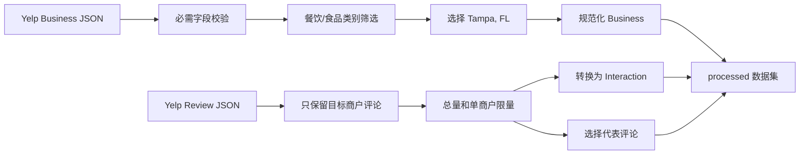
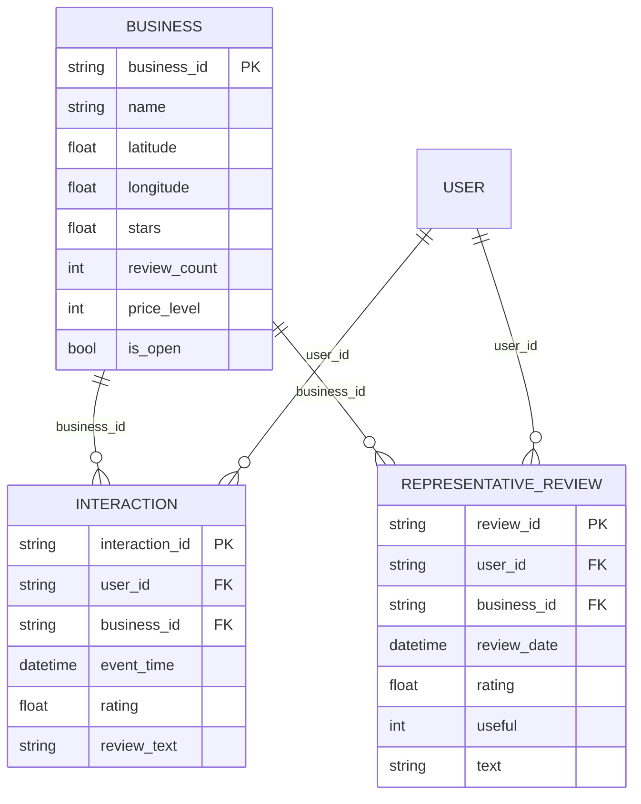

# CampusFoodAgent v2 数据集说明

> 文档日期：2026年7月15日
>
> 数据版本：`yelp_open_dataset_local`
>
> 数据范围：Tampa, Florida 单城市餐饮与食品商户子集

## 1. 数据集是什么

CampusFoodAgent v2 使用 [Yelp Open Dataset](https://business.yelp.com/data/resources/open-dataset/) 的公开商户和评论数据，经过本地脚本处理后形成一个适合学习、复现和项目实现的 Tampa 单城市子集。

本项目不直接使用 Yelp 全量数据，也不需要用大规模数据证明工程能力。当前子集的目标是以可控的数据量完整练习以下流程：

- 原始数据读取、字段校验和清洗；
- 城市与餐饮类别筛选；
- 商户、用户和评论交互建模；
- 地理硬过滤与基础推荐；
- 用户画像、ItemCF 和排序实验；
- 评论检索、RAG 证据和推荐解释；
- 固定数据版本下的可复现实验。

处理后的数据不是虚构数据。商户 ID、用户 ID、评论 ID、评分、文本、时间和经纬度均来自 Yelp 原始数据；项目只进行了范围筛选、字段规范化和数量限制。

## 2. 为什么使用处理后的子集

当前项目定位是研一阶段的学习与复现，不是生产级 Yelp 服务。使用单城市子集有以下优势：

1. 数据量可以在个人电脑上反复清洗、建索引和做实验；
2. 单城市经纬度更适合验证距离过滤和地理推荐；
3. 10 万条交互足够实现推荐系统的主要学习模块；
4. 约 2.9 万条评论证据足够比较关键词与向量检索；
5. 固定处理参数后，实验更容易复现和解释；
6. RTX 5060 8GB 无需承担全量数据和大型模型训练压力。

结论：当前规模足够支撑 CampusFoodAgent v2 的学习、复现和项目实现，不需要为了追求数据量而改用 Yelp 全量数据。

## 3. 数据处理流程

处理脚本位于：

```text
v2/backend/app/data_pipeline/curate_yelp.py
```

当前处理流程：



主要处理规则：

| 规则 | 当前设置 |
| --- | --- |
| 城市 | Tampa |
| 州 | FL |
| 商户范围 | `Restaurants`、`Food`、`Coffee`、`Bars` 等餐饮/食品相关类别 |
| Review 总量上限 | 100,000 |
| 每家商户最大交互数 | 40 |
| 每家商户最大代表评论数 | 8 |
| 关闭商户 | 保留历史数据，通过 `is_open` 标记 |
| 输出格式 | JSONL + JSON manifest |

## 4. 当前数据规模

以下数字来自 `v2/backend/data/processed/data_manifest.json`：

| 数据项 | 数量 |
| --- | ---: |
| 商户总数 | 3,805 |
| 当前标记为营业的商户 | 2,596 |
| 当前标记为关闭的商户 | 1,209 |
| Review 映射交互 | 100,000 |
| 代表评论 | 29,092 |
| 有交互和代表评论的商户 | 3,782 |
| 交互用户 | 49,605 |

处理后交互的时间范围为：

```text
2005年8月18日—2022年1月19日
```

这个时间范围用于离线学习和复现实验。项目不把它表述为 2026 年实时餐厅数据。

### 4.1 用户历史分布

| 用户历史条件 | 用户数 | 占交互用户比例 |
| --- | ---: | ---: |
| 至少 2 条交互 | 13,987 | 28.20% |
| 至少 3 条交互 | 7,080 | 14.27% |
| 至少 5 条交互 | 3,023 | 6.09% |
| 至少 10 条交互 | 1,065 | 2.15% |

建议用途：

- 全部用户用于数据统计和冷启动分析；
- 历史数不少于 3 的用户用于基础时间切分；
- 历史数不少于 5 的用户用于主要个性化实验；
- 历史较少的用户保留为 cold/light 用户分群。

### 4.2 评分分布

| 评分 | 数量 |
| --- | ---: |
| 1 星 | 15,029 |
| 2 星 | 8,192 |
| 3 星 | 11,086 |
| 4 星 | 22,194 |
| 5 星 | 43,499 |

推荐实验可以把 4–5 星作为强正反馈、1–2 星作为显式负偏好，3 星单独处理。具体阈值必须固定在实验配置中，不能根据测试结果临时调整。

## 5. processed 文件结构

```text
v2/backend/data/processed/
├── businesses.jsonl
├── interactions.jsonl
├── representative_reviews.jsonl
├── city_statistics.json
└── data_manifest.json
```

| 文件 | 主要内容 | 主要用途 |
| --- | --- | --- |
| `businesses.jsonl` | 目标城市商户及结构化属性 | 商户库、硬过滤、地理与内容特征 |
| `interactions.jsonl` | Yelp Review 映射的用户交互 | 画像、协同召回、标签和离线评估 |
| `representative_reviews.jsonl` | 每家商户有限条高价值评论 | BM25、向量检索、RAG 证据和解释 |
| `city_statistics.json` | 各城市餐饮数据密度统计 | 解释城市选择和数据范围 |
| `data_manifest.json` | 参数、保留量、舍弃量和来源 | 数据版本、复现和结果审计 |

## 6. Business：商户实体

`businesses.jsonl` 每一行表示一个商户。

### 6.1 字段说明

| 字段 | 类型 | 含义 | 在项目中的用途 |
| --- | --- | --- | --- |
| `business_id` | string | Yelp 商户唯一标识 | 推荐结果主键、证据关联、候选白名单 |
| `name` | string | 商户名称 | API 展示和文本检索 |
| `categories_raw` | string | Yelp 原始类别字符串 | 保留原始事实，支持追溯 |
| `categories_normalized` | list[string] | 按逗号拆分后的类别 | 类别过滤、内容特征、画像偏好 |
| `latitude` | float | 纬度 | Haversine 距离和地理召回 |
| `longitude` | float | 经度 | Haversine 距离和地理召回 |
| `city` | string | 城市 | 城市硬过滤 |
| `state` | string | 州 | 数据范围校验 |
| `stars` | float | 商户平均评分 | 热门基线和排序特征 |
| `review_count` | int | Yelp 原始评论总数 | 评分置信度和热度特征 |
| `price_level` | int/null | 价格等级 1–4 | 预算硬过滤和价格偏好 |
| `hours` | object | 每周营业时间 | 后续营业时间过滤 |
| `attributes` | object | 停车、外卖、信用卡等属性 | 结构化筛选、文本特征和解释 |
| `is_open` | bool | Yelp 数据中的营业标记 | 排除关闭商户 |
| `data_version` | string | 本地数据版本 | API、索引和实验版本追踪 |

### 6.2 Business 特征可以做什么

结构化硬过滤：

- 城市；
- 最大距离；
- 是否营业；
- 价格上限；
- 类别和用户明确排除项。

召回与排序特征：

- 经纬度和距离；
- 类别匹配度；
- 平均评分；
- 评论数置信度；
- 价格匹配；
- 商户属性与查询词匹配。

RAG 结构化证据：

- 商户名称与类别；
- 价格等级；
- 营业时间；
- 停车、外卖和场景属性。

### 6.3 Business 字段边界

- 664 家商户缺少 `price_level`；
- 420 家商户缺少 `hours`；
- 关闭商户可用于历史交互，但不应进入在线候选；
- 餐饮/食品筛选范围比严格的 `Restaurants` 更宽，后续可以增加 `is_restaurant` 或业务类别分组，但本阶段不重新处理数据。

## 7. Interaction：用户交互实体

`interactions.jsonl` 的每一行由一条 Yelp Review 转换而来。

### 7.1 字段说明

| 字段 | 类型 | 含义 | 在项目中的用途 |
| --- | --- | --- | --- |
| `interaction_id` | string | 交互唯一标识，当前等于 review ID | 去重、切分和追溯 |
| `user_id` | string | Yelp 匿名用户标识 | 用户画像、ItemCF 和分群 |
| `business_id` | string | 被评论商户标识 | 连接 Business 与评论证据 |
| `event_type` | string | 当前固定为 `review` | 统一事件协议 |
| `event_time` | datetime string | 评论发生时间 | 时间切分、画像快照和泄漏检查 |
| `rating` | float | 用户对商户的 1–5 星评分 | 正负反馈标签和评分倾向 |
| `review_text` | string | 评论文本 | 用户文本偏好和内容特征 |
| `source` | string | 当前为 `yelp_review` | 区分公开数据和未来 demo 事件 |

### 7.2 Interaction 可以做什么

用户画像：

- 历史类别分布；
- 常见价格区间；
- 评分严格程度；
- 历史活动中心；
- 高评分评论文本偏好；
- 最近访问商户与类别序列。

推荐实验：

- ItemCF 商户共现；
- 用户—商户矩阵；
- 高评分正样本与低评分负偏好；
- 时间留一法；
- cold/light/warm 用户分群；
- Recall、HitRate、NDCG 和 Coverage 评估。

时间切分时，画像只能读取目标交互之前的数据。测试目标不能参与画像、召回统计或特征计算。

## 8. RepresentativeReview：代表评论实体

`representative_reviews.jsonl` 为每个有交互商户最多保留 8 条代表评论。

### 8.1 字段说明

| 字段 | 类型 | 含义 | 在项目中的用途 |
| --- | --- | --- | --- |
| `review_id` | string | Yelp 评论唯一标识 | RAG document ID 和引用 |
| `business_id` | string | 评论所属商户 | 证据白名单和商户分组 |
| `user_id` | string | 评论用户标识 | 数据追溯，不直接展示 |
| `rating` | float | 本条评论评分 | 观点与情感辅助特征 |
| `review_date` | datetime string | 评论日期 | 证据时间信息 |
| `useful` | int | Yelp useful 计数 | 代表评论筛选和证据排序 |
| `text` | string | 评论原文 | BM25、向量检索和解释证据 |
| `source` | string | 当前为 `yelp_review` | 证据来源标识 |

### 8.2 RepresentativeReview 可以做什么

- 建立 BM25 关键词索引；
- 使用小型文本编码器生成向量；
- 建立 FAISS 向量索引；
- 查询环境、口味、服务、排队和性价比等软偏好；
- 为推荐理由返回可追溯的 `review_id`；
- 比较 BM25、向量和 Hybrid 检索。

代表评论用于解释候选商户，不负责绕过推荐候选集发现新商户。

## 9. manifest：数据事实清单

`data_manifest.json` 记录：

```text
data_version
selected_city
selection_policy
limits
kept
discarded
retained_raw_sources
excluded_raw_sources
outputs
```

它是以下内容的事实来源：

- 本次选择了哪个城市；
- 使用了哪些处理上限；
- 保留和舍弃了多少数据；
- 哪些原始文件进入了首版链路；
- 输出文件名称和数据版本。

README、实验报告和面试表述中的数据规模应从 manifest 读取，不手工估算。

## 10. 数据实体之间的关系



核心连接键：

- `business_id` 连接商户、交互和评论证据；
- `user_id` 连接同一用户的历史交互；
- `interaction_id`/`review_id` 保证原始 Review 可追溯。

## 11. 数据可以支撑哪些项目模块

| 模块 | 使用的数据 | 当前规模是否足够 |
| --- | --- | --- |
| 真实商户 API | Business | 足够 |
| 城市、距离、价格、营业过滤 | Business 结构化字段 | 足够 |
| 地理热门基线 | 经纬度、评分、评论数 | 足够 |
| 用户画像 | Interaction 历史 | 足够，使用历史数不少于 3 或 5 的用户 |
| ItemCF | user ID、business ID、rating、time | 足够 |
| 内容/冷启动召回 | 类别、属性、评论文本 | 足够 |
| LightGBM 排序 | 召回特征、距离、评分、价格 | 足够完成学习实验 |
| BM25/向量 RAG | 29,092 条代表评论 | 足够 |
| 离线评估 | 时间、用户、商户和评分 | 足够完成固定切分实验 |
| 大型深度模型训练 | 当前子集 | 不是本项目目标 |

## 12. RTX 5060 8GB 环境下的使用建议

当前数据规模与硬件匹配良好：

- JSONL 清洗、ItemCF、RRF 和指标计算使用 CPU；
- LightGBM 首版使用 CPU 即可；
- 评论文本向量可以使用小型 sentence-transformer；
- 约 2.9 万条评论可以分批编码，避免一次占满显存；
- FAISS 首版使用 CPU 索引即可；
- LLM 通过 API 调用，不在本地训练大语言模型；
- 每次实验保存配置、manifest 和指标，优先保证可复现。

建议先完成简单、可解释的 baseline，再决定是否增加模型复杂度。

## 13. 数据使用边界

需要在项目说明和实验报告中明确：

1. 这是 Yelp Tampa 处理子集，不是 Yelp 全量数据；
2. Review 被限制为总计 100,000 条、每商户最多 40 条；
3. 用户交互天然稀疏，个性化主实验使用满足最小历史长度的用户；
4. 缺少价格或营业时间的商户需要明确处理策略；
5. `is_open` 是数据集字段，不代表 2026 年实时状态；
6. Yelp 公开交互与未来 demo 事件必须通过 `source` 分开；
7. 原始 Yelp 文件、索引和大型产物不提交到仓库；
8. 数据的下载、使用和展示遵守 Yelp Open Dataset 的许可条件。

这些边界不影响学习和复现，只用于保证项目表述准确。

## 14. 事实来源

```text
v2/backend/data/processed/data_manifest.json
v2/backend/data/processed/businesses.jsonl
v2/backend/data/processed/interactions.jsonl
v2/backend/data/processed/representative_reviews.jsonl
v2/backend/data/processed/city_statistics.json
v2/backend/app/data_pipeline/curate_yelp.py
v2/backend/data/README.md
```
