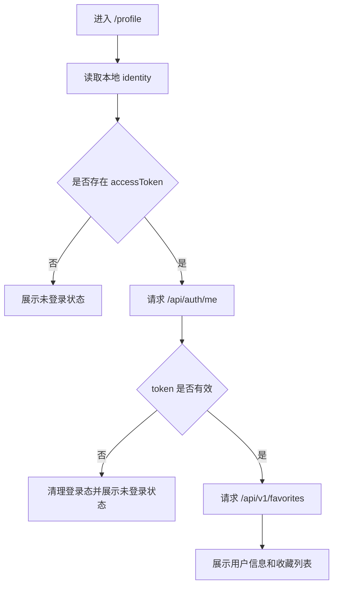
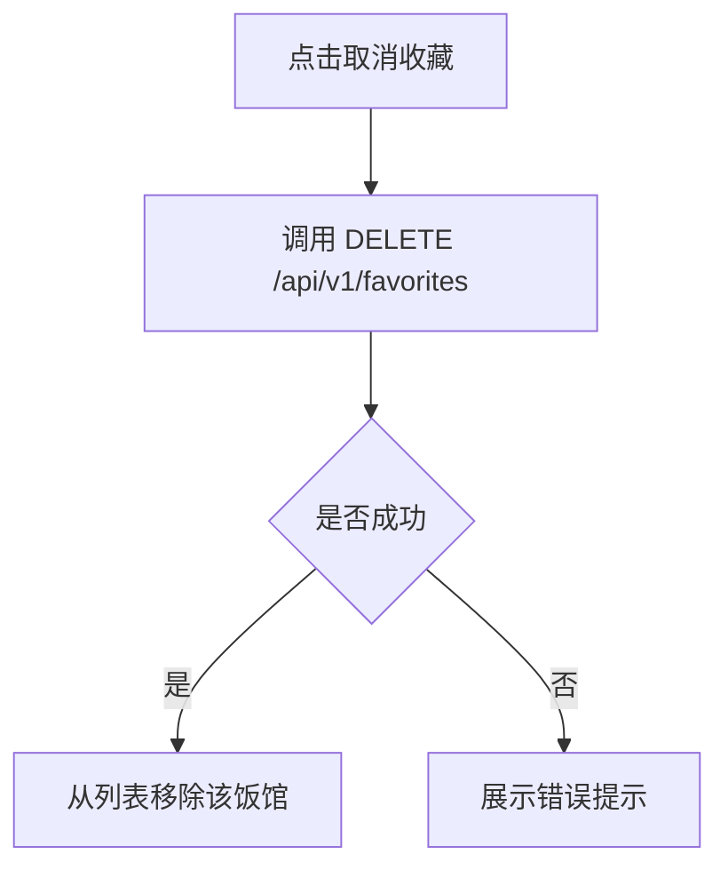

# Chapter 12：Web 个人中心页面

## 目标

本章目标是在 Next.js Web 前端中增加一个“个人中心”页面，用来让已登录用户查看自己的账号信息和收藏过的饭馆。

本章不扩展推荐算法，不新增复杂社交功能，只做一个简历项目里足够完整、可演示、可解释的账号页面。

最终效果：

- 用户可以从首页进入个人中心。
- 未登录用户进入个人中心时，看到登录引导。
- 已登录用户可以看到自己的 `userId`、登录状态、账号类型。
- 已登录用户可以看到收藏过的饭馆列表。
- 用户可以从个人中心取消收藏。
- 页面刷新后仍能根据本地 token 恢复登录状态。

## 本章定位

第 11 章已经完成了多端账号体系：

- Web 端邮箱注册 / 登录。
- 小程序端微信登录。
- JWT 保护接口。
- 匿名身份升级为登录身份。
- 收藏接口需要登录 token。

第 12 章是在第 11 章基础上补齐 Web 端用户体验，让账号体系不只停留在接口层，而是在页面上能被用户看到和使用。

## 不做什么

本章先不做以下内容：

- 不做头像上传。
- 不做邮箱验证码。
- 不做修改密码。
- 不做复杂个人资料编辑。
- 不做用户昵称系统。
- 不做订单、积分、会员等商业功能。

这些功能会增加大量边界情况，对当前简历项目收益不高。

## 页面设计

建议新增页面：

```text
frontend/src/app/profile/page.tsx
```

页面名称：

```text
个人中心
```

入口位置：

首页顶部导航或右上角用户区域增加一个“个人中心”入口。

建议路由：

```text
/profile
```

## 页面状态

个人中心至少处理三种状态。

### 1. 加载中

进入页面后读取本地身份信息：

- anonymousId
- accessToken
- userId
- tokenExpiresAt

如果正在请求 `/api/auth/me` 或收藏列表，可以展示轻量 loading 状态。

### 2. 未登录

如果没有有效 `accessToken`：

页面展示：

- 当前是匿名用户。
- 提示登录后可以同步收藏。
- 提供“去登录”按钮，返回首页或打开已有登录弹窗。

注意：未登录状态不要直接请求收藏接口，因为收藏接口需要 token。

### 3. 已登录

如果有有效 token，并且 `/api/auth/me` 校验通过：

页面展示：

- 登录状态：已登录。
- 用户 ID：`userId`。
- 账号类型：
  - `em_` 开头：邮箱账号。
  - `wx_` 开头：微信账号。
  - 其他：系统账号。
- 收藏饭馆列表。
- 退出登录按钮。

## 接口使用

本章优先复用已有接口，不新增后端接口。

### 校验当前用户

```http
GET /api/auth/me
Authorization: Bearer <accessToken>
```

成功返回：

```json
{
  "userId": "em_xxxxx",
  "authenticated": true
}
```

用途：

- 验证 token 是否仍然有效。
- 防止前端只相信 localStorage。

### 获取收藏列表

```http
GET /api/v1/favorites
Authorization: Bearer <accessToken>
```

用途：

- 渲染用户收藏过的饭馆。

### 取消收藏

```http
DELETE /api/v1/favorites
Authorization: Bearer <accessToken>
Content-Type: application/json
```

请求体：

```json
{
  "shop_id": 1
}
```

用途：

- 用户在个人中心直接取消收藏。
- 取消成功后刷新收藏列表，或在前端本地移除该项。

## 前端模块建议

建议优先复用已有文件：

```text
frontend/src/lib/api.ts
frontend/src/lib/identity.ts
frontend/src/app/page.tsx
```

可以新增：

```text
frontend/src/app/profile/page.tsx
```

如果 `api.ts` 里已经有收藏相关方法，就直接复用。

如果没有，可以补充以下封装：

- `getMe()`
- `getFavorites()`
- `removeFavorite(shopId)`

如果 `identity.ts` 里还没有统一退出登录方法，可以补充：

- `logoutIdentity()`

这样首页和个人中心可以共用同一套身份逻辑。

## UI 结构建议

个人中心页面建议分成三个区域。

### 顶部账号区

展示：

- 页面标题：个人中心
- 登录状态
- 用户 ID
- 账号类型
- 退出登录按钮

### 收藏饭馆区

展示：

- 收藏数量
- 饭馆名称
- shop_id
- 取消收藏按钮

如果收藏为空：

```text
还没有收藏饭馆
```

可以提供一个“去首页推荐”按钮。

### 返回入口

提供返回首页按钮：

```text
返回推荐页
```

## 推荐交互流程

### 已登录用户查看个人中心



### 取消收藏



## 错误处理

需要处理以下情况：

- token 过期：清理登录态，提示重新登录。
- 收藏接口返回 401：清理登录态，提示重新登录。
- 网络错误：展示“加载失败，请稍后再试”。
- 收藏为空：展示空状态，不要显示错误。
- 取消收藏失败：保留原列表，并提示失败。

## 验收标准

完成本章后，需要满足：

- 打开 `/profile` 不报错。
- 未登录访问 `/profile` 显示登录引导。
- 邮箱登录后访问 `/profile` 能看到自己的 `userId`。
- 收藏饭馆后访问 `/profile` 能看到收藏列表。
- 在 `/profile` 取消收藏后，列表会更新。
- token 失效时，不会继续展示“已登录”假状态。
- 首页可以进入个人中心，个人中心可以返回首页。

## 测试建议

### 手动测试

1. 清空浏览器 localStorage。
2. 打开首页，进入个人中心。
3. 确认显示未登录状态。
4. 返回首页，使用邮箱登录。
5. 收藏一个饭馆。
6. 进入 `/profile`。
7. 确认显示用户信息和收藏饭馆。
8. 点击取消收藏。
9. 确认收藏列表更新。
10. 退出登录。
11. 确认个人中心回到未登录状态。

### 自动化测试

如果后续写前端测试，可以覆盖：

- 未登录状态渲染。
- 已登录状态渲染。
- 收藏列表为空状态。
- 收藏列表有数据状态。
- 取消收藏后列表更新。

## 简历表达

本章完成后，可以在简历中这样描述：

```text
实现 Web 端个人中心页面，基于 JWT 完成登录态校验，支持用户信息展示、收藏饭馆查询与取消收藏，并处理 token 过期、未登录、空收藏等状态。
```

如果和第 11 章合并描述：

```text
设计多端账号体系，支持 Web 邮箱登录与微信小程序登录，通过 JWT 保护收藏等用户接口，并实现个人中心查看账号信息和收藏记录。
```

## 本章知识点

- Next.js App Router 页面拆分。
- 前端登录态恢复。
- JWT token 校验。
- 受保护接口调用。
- 个人中心页面状态设计。
- 空状态、错误状态、加载状态处理。
- 用户收藏数据的前后端闭环。

## 完成后的项目价值

完成个人中心后，项目会从“推荐页面 Demo”进一步变成“有账号、有收藏、有个人数据闭环”的完整应用。

这对简历很重要，因为它说明你不只是会调推荐接口，还理解一个真实产品需要：

- 用户身份。
- 用户数据。
- 登录态。
- 个人页面。
- 跨页面状态同步。
- 接口权限控制。
